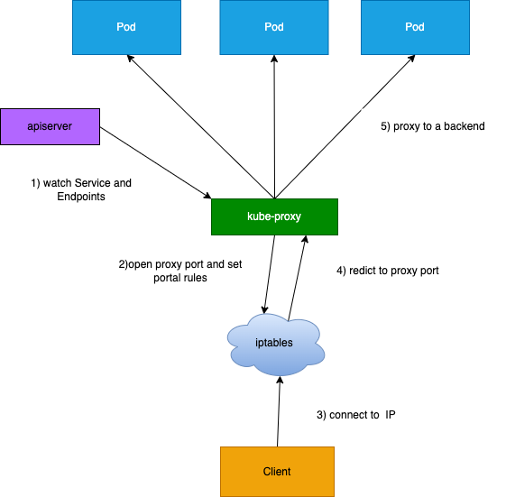

# Service 的概念
Kubernetes Service 定义了这样一种抽象：一个 Pod 的逻辑分组，一种可以访问他们的策略————通常称为服务，这一组 Pod 能被 Service 访问到，通常是通过 Label Selector
官网中的说法：Kubernetes 中 Service 是 将运行在一个或一组 Pod 上的网络应用程序公开为网络服务的方法

Service 能够提供负载均衡能力，但在使用上有以下限制：
- 只能提供4层负载均衡，没有7层功能，有时我们需要更多的匹配规则来转发请求，这是4层负载均衡不支持的（即只能基于IP和端口转发，不能通过主机名或域名转发）

# Service 类型
有以下四种类型：
- ClusterIP：默认类型，自动分配一个仅集群内部可以访问的虚拟IP
- NodePort：在 ClusterIP 的基础上为 Service 在每台机器上绑定一个端口，这样既可以通过 NodePort 访问服务
- LoadBalancer：在 NodePort 的基础上，借助 cloud provider 创建一个外部负载均衡器，并将请求转发到 NodePort
- ExternalName：把集群外部服务引入到集群内部来，在集群内部直接使用，没有任何类型代理被创建
  



# VIP 和 Service 代理
在 Kubernetes 集群中，每个 Node 运行一个 kube-proxy 进程，kube-proxy 负责为 Service 实现了一种 VIP（虚拟IP）的形式，而不是 ExtrnalName 的模式

为什么不用 DNS 进行负载均衡？
DNS会被缓存


# Ingress
Ingress 是对集群中服务的外部访问进行管理的 API 对象，典型的访问方式是 HTTP。
Ingress 可以提供负载均衡、SSL 终结和基于名称的虚拟托管。

## Ingress 是什么
Ingress 公开从集群外部到集群内服务的 HTTP 和 HTTPS 路由。 流量路由由 Ingress 资源上定义的规则控制

## 使用
需要先安装一个 Ingress Controller，
[ingress-nginx](https://kubernetes.github.io/ingress-nginx/deploy/)
[其他控制器](https://kubernetes.io/zh-cn/docs/concepts/services-networking/ingress-controllers)

根据 ingress-nginx 文档部署

### Ingress HTTP 代理访问
Deployment、Service、Ingress yml文件
```yml
apiVersion: extensions/v1beta1
kind: Deployment
metadata:
  name: nginx-dm
spec:
  replicas: 2
  template:
    metadata:
      labels:
        name: nginx
    spec:
      controllers:
        - name: nginx
          image: myapp:v1
          ports:
            - containerPort: 80
---
apiVersion: v1
kind: Service
metadata:
  name: nginx-svc
spec:
  ports:
    - port: 80
      targetPort: 80
      protocol: TCP
  selectors:
    name: nginx
---

apiVersion: extensions/v1
kind: Ingress
metadata:
  name: nginx-test
spec:
  rules:
    - host: foo.bar.com
      http:
        paths:
          - path: /
            backend:
              serviceName: nginx-svc
              servicePort: 80
```

### Ingress HTTPS 代理访问
创建证书，以及 cert 存储方式
```
openssl req -x500 -sha256 -nodes -days 365 -newkey rsa:2048 -keyout tls.key -out tls.crt -subj "/CN=nginxsvc/0=nginxsvc"

kubectl create secret tls tls-secret --key tls.key --cert tls.crt
```

```yml
apiVersion: extensions/v1beta1
kind: Ingress
metadata:
  name: nginx-test
spec:
  tls:
    - hosts: 
      - foo.bar.com
      secretName: tls-secret
  rules:
    - host: foo.bar.com
      http:
        paths:
          - path: /
            backend:
              serviceName: nginx-svc
              servicePort: 80
```
