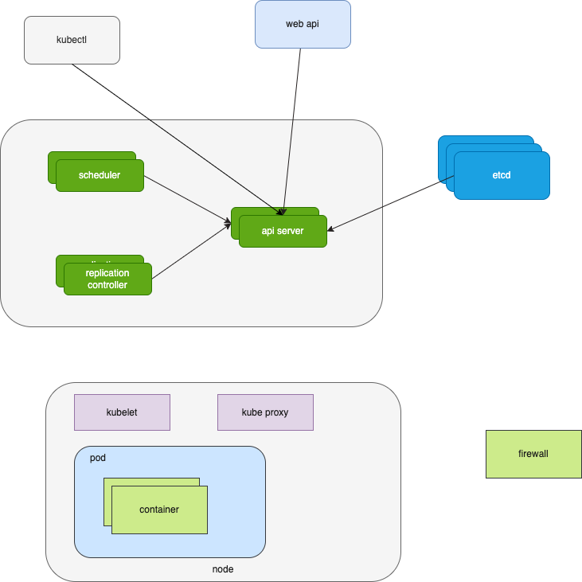
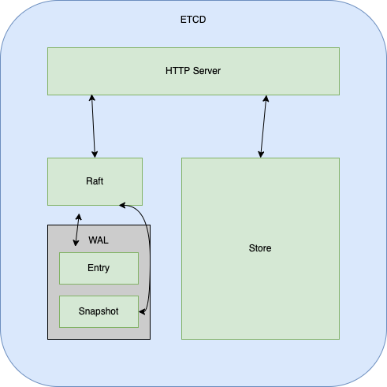

# 组件


## Master Node
主节点的3个核心组件：
1. API Server
2. Schedluer
3. Controller

etcd的官方将它定位为一个*可信赖的* *分布式键值存储服务*，它能够为整个分布式集群存储一些关键数据，协助分布式集群的正常运转



## Node 组件
节点组件会在每个节点上运行，负责维护运行的 Pod 并提供 Kubernetes 运行环境

### kubelet
会在集群中的每个节点上运行，它保证容器的运行，管理容器创建等操作，维护pod 的生命周期
kubelet 接收 PodSpecs，确保PodSpecs 中描述的容器处于运行状态且健康，其他非k8s创建的容器它不会管理

### kube-proxy
在每个节点上运行的网络代理，是实现`Service`概念的一部分
维护节点上的网络规则，这些规则会控制集群内外与Pod 的网络会话
如果操作系统提供了可用的数据包过滤层，则 kube-proxy 会通过它来实现网络规则。 否则，kube-proxy 仅做流量转发。

## 插件
### DNS
COREDNS 为集群中的SVC创建DNS服务
### Dashboard
提供管理集群的Web页面
### INGRESS
k8s默认只支持四层代理，ingress可以实现七层代理


# Kubernetes 对象
在 Kubernetes 系统中， `Kubernetes Objects`是持久化的实体。k8s使用这些实体去表示整个集群的状态。
它们描述了以下信息：
1. 哪些容器化应用正在运行（以及在哪些节点上运行）
2. 可以被应用使用的资源
3. 应用运行时的策略，例如重启策略、升级策略以及容错策略

一旦创建对象，k8s系统将不断工作确保对象存在
通过创建对象，告知k8s系统：你想要的集群工作负载应该是什么样子的，这就是集群的*期望状态 Desired State*

## 对象规约（Spec）与状态（Status）

## 描述 Kubernetes 对象
可以使用JSON 或 ymal 文件 为 kubectl 提供对象信息
例如：
```yml
apiVersion: apps/v1
kind: Deployment
metadata:
  name: nginx-deployment
spec:
  selector:
    matchLabels:
      app: nginx
  replicas: 2 # 告知 Deployment 运行 2 个与该模板匹配的 Pod
  template:
    metadata:
      labels:
        app: nginx
    spec:
      containers:
      - name: nginx
        image: nginx:1.14.2
        ports:
        - containerPort: 80
```
使用 kubectl：
```
kubectl apply -f k8s.yml
```

字段：
- apiVersion    创建对象要使用的Kubernetes API 版本
- kind          要创建的对象的类别
- metadata      帮助唯一标识对象的一些数据，包括 name UID namespace
- spec          你所期望的对象状态


# POD
Pod 是可以在 Kubernetes 中创建和管理的、最小的可部署的计算单元
Pod 是一组容器，这些容器共享存储、网络、以及怎样运行这些容器的声明
在 Pod 中，又一个基础容器 pause ，在Pod启动时启动，Pod中的容器共用 pause 的网络和存储卷，这就意味着容器没有自己的网络地址，端口也不能冲突

## 自主式 Pod
## 控制器管理的 Pod
有以下控制器：
- Deployment
  - ReplicationController   用来保证容器应用的副本数量始终是用户定义的数量
  - ReplicaSet              与上一个没有本质的不同，支持集合式的 selector
- StatefulSet 是为了解决有状态服务的问题，其应用场景包括：
  - 稳定的持久化存储，即 Pod 重新调度后还能访问持久化数据，基于PVC实现
  - 稳定的网络标志，即 Pod 重新调度后其 PodName 和 HostName 不变，基于 Headless Service（即没有 Cluster IP 的 Service）实现
  - 有序部署，有序扩展  即 Pod 是有顺序的，基于 init container 实现
  - 有序收缩，有序删除
- DaemonSet   确保全部 Node 上运行一个 Pod 的副本，当有 Node 加入集群时，也会为他们新增一个 Pod，当有 Node 移除时，这些 Pod 也会回收，删除 DaemoSet会删除所有他创建的 Pod。一些典型用法：
  - 运行集群存储 daemon
  - 在每个 Node 上运行日志收集 daemon
  - 在每个 Node 上运行监控 daemon
- Job，CronJob    负责批处理任务，即仅执行一次的任务，它保证批处理任务的一个或多个 Pod 成功结束

## 使用Pod
示例：
```yml
apiVersion: v1
kind: Pod
metadata:
  name: nginx
spec:
  containers:
  - name: nginx
    image: nginx:1.14.2
    ports:
    - containerPort: 80
```
运行命令：
```
kubectl apply -f k8s.yml
```