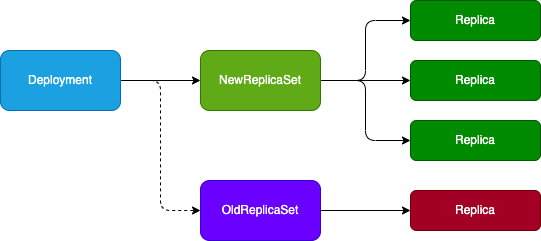

# 什么是资源控制器
见 概念

## RS、Deployment
### RS 与 RC 与 Deployment 的关联
RC（ReplicationController）主要的作用就是用来确保容器应用的副本数始终保持在用户定义的副本数，即如果有容器异常退出会自动创建新 Pod，异常多出来的容器也会被回收

Kubernetes 官方建议使用 RS（ReplicaSet）代替 RC 进行部署，RS 跟 RC 并没有本质上的不同，RS 支持集合式的 selector

RS 示例：（可以通过 `kubectl explain rs`查看完整信息）
```yml
apiVersion: extensions/v1beta1
kind: ReplicaSet
metadate:
  name: frontend
spec:
  replicas: 3
  selector:
    # 通过 label 匹配 Pod 副本
    metchLabels:
      tier: frontend
  # 相当于 Pod
  template:
    metadate:
      labels:
        tier: frontend
    spec:
      containers:
        - name: php-redis
          image: php:v2
          env:
            - name: GET_HOST_FROM
              value: dns
          ports:
            - containerPort: 80
```

#### RS 与 Deployment 的关联


#### Deployment
Deployment 为 Pod 和 ReplicaSet 提供了一种声明式定义方法，同来替代以前的 ReplicationController 来方便的管理应用。典型的应用场景包括：
- 定义 Deployment 来创建 Pod 和 ReplicaSet
- 滚动升级和回滚应用
- 扩容和缩容
- 暂停和继续 Deployment

部署一个简单的 Nginx 应用：
```yml
apiVersion: extensins/v1beta1
kind: Deployment
metadate:
  name: nginx-deployment
spec:
  replicas: 3
  template:
    metadate:
      labels:
        app: nginx
    spec:
      containers:
        - name: nginx
          image: nginx:1.2
          prots:
            - containerPort: 80
```
```
kubectl create -f app.yml
```
扩容：
```
kubectl scale deployment mginx-deployment --replicas 10
```

如果集群支持 horizontal pod autoscaling 的话，还可以为 Deployment 设置自动扩容
```
kubectl autoscale deployment nginx-deployment --min=10 --max=15 --cpu-percent=80
```

更新镜像：
```
kubectl set image deployment/nginx-deployment nginx=nginx:1.7
```

回滚：
```
kubectl rollout undo deployment/nginx-deployment 
```

#### Deployment 更新策略
Deployment 可以保证在升级时只有一定数量的 Pod 是 down 的，默认的，他会确保有比期望的 Pod 数量少一个是 up 状态（最多一个不可用）
Deployment 同时也可以确保只创建出超过期望数量的一定数量的 Pod，默认的，他会确保最多比期望的 Pod 数量多一个的 Pod 是 up 的（最多1个surge）
未来的 Kubernetes 版本中，将从 1-1 变成25%-25%

#### Rollover（多个 rollout 并行）
假如你创建了一个有5个 nginx replica 的 Deployment，但是当还只有3个 replica 被创建出来的时候你就开始更新 Deployment，在这种情况下，Deployment会立即杀死已有的3个 Pod，并开始创建新的 Pod，他不会等到5个 Pod 创建完成后才开始改变航道

#### 回退 Deployment
```
# 更新 Deployment 的镜像
kubectl set image deployment/nginx-deployment nginx=nginx:1.7

# 查看 Deployment 更新状态
kubectl rollout status deployment/nginx-deployment

# 查看更新历史
kubectl rollout history deployment/nginx-deployment

# 回退
kubectl rollout undo deployment/nginx-deployment 

# 回退到指定版本
kubectl rollout undo deployment/nginx-deployment --to-revision=2

# 暂停 deployment 的更新
kubectl rollout pause deployment/nginx-deployment 
```

#### 清理 Policy
可以通过设置 `.spec.revsionHistoryLimit`来指定 Deployment 最多保留多少 revision 历史记录，默认全部保留，如果设置为0， deployment 没有历史记录就不允许回滚


## DaemonSet
DaemonSet 确保所有或一些 Node 上运行一个 Pod 的副本，当有 Node 加入集群时，新增 Pod，Node 从集群移除时，Pod 回收，删除 DaemonSet 会删除所有他创建的 Pod，典型用法：
- 运行集群存储 Daemon
- 日志收集
- 监控

```yml
apiversion: apps/v1
kind: DeamonSet
metadata:
  name: deamonset-example
  labels: 
    app: deamonset
spec:
  selector:
    matchLabels:
      name: deamonset-example
    template:
      metadata:
        labels: 
          name: deamonset-example
      spec:
        containers:
          - name: deamonset-example
            image: myapp:v1
```

## Job
Job 负责批处理任务
特殊说明：
- spec.template 格式同 Pod
- restartPolicy 仅支持 Never 或 OnFailure
- 单个 Pod 时，默认 Pod 成功运行后 Job 结束
- `.spec.completions`标志 Job 结束需要成功运行的 Pod 个数，默认 1
- `.spec.parallelism`标志并行运行 Pod 个数，默认 1
- `.spec.activeDeadlineSeconds`标志失败 Pod 的重试最大时间，超过这个时间不会继续重试

```yml
apiVersion: batch/v1
kind: Job
metadata:
  name: pi
spec:
  template:
    metadata:
      name: pi
    spec:
      containers:
        - name: pi
          image: perl
          command: ['perl', '-Mbignum=bpi', '-wle', 'print bpi(2000)']
      restartPolicy: Never
```
