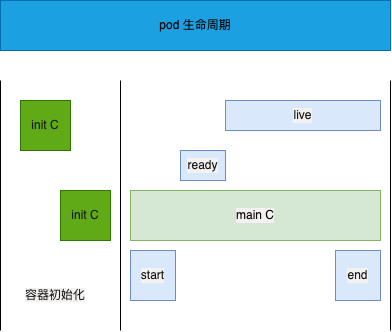

# k8s 中的资源
集群资源分类：
- 命名空间资源
  只在对应命名空间生效
- 集群级别
  role，在全集群可见
- 元数据
  通过指标操作

k8s 中的所有内容都被抽象为资源，资源实例化后叫做对象
- namespace
  - 工作负载型资源 workload
    Pod、ReplicaSet、Deployment、statefulSet、DaemonSet、Job、CronJob
  - 服务发现及负载均衡型资源  SerivceDiscovery LoadBalance
    Service、Ingress
  - 配置与存储型资源
    Volume（存储卷）、CSI（容器存储接口）
  - 特殊类型的存储卷
    ConfigMap（当配置中心来使用的资源类型）、Secret（保存敏感数据）、DownwardAPI（把外部环境中的信息输出给容器）
- 集群级资源
  - namespace Node Role ClusterRole RoleBinding ClusterRoleBinding
- 元数据型资源
  - HPA PodTemplate LimitRange


# 资源清单
在 k8s 中，一般使用 ymal 格式的文件来创建符合我们预期的 pod，这样的 ymal 文件一般称为资源清单
## 字段
|参数|类型|说明|
|-|-|-|
|version|String|K8S API 的版本，目前基本上是v1，可以用 kubectl api-versions 命令查看|
|kind|String|资源类型和角色，例如Pod|
|metadata|Object|元数据对象|
|metadata.name|String|元数据对象的名字，比如Pod的名字|
|metadata.namespace|String|命名空间|
|Spec|Object|详细定义对象|
|spec.containers[]|list|容器列表|
|spec.containers[].name|String|容器名字|
|spec.containers[].image|String|镜像名|
|spec.containers[].imagePullPolicy|String|镜像拉取策略，有Always、Never、IfNotPresent，默认Always|
|spec.containers[].command[]|list|容器启动命令|
|spec.containers[].args[]|list|容器启动参数|
|spec.containers[].workDir|String|容器工作目录|
|spec.containers[].env|list|容器环境变量|
|volume||容器挂载卷|
|ports||端口|
|spec.restartPolicy|string|Pod 重启策略，可选Always、OnFallure、Never，默认Always|
|spec.nodeSelector|Object|定义Node的Label过滤标签，以 key:vakue 形式指定|
|spec.imagePullSecrets|Object|定义pull镜像时使用的secret名称， name:secretkey|
|spec.hostNetwork|Boolean|定义是否使用主机的网络模式，默认false，true表示使用主机网络，不使用docker网桥，设置true将无法在同一台宿主机上启动第二个副本|
||||
||||
||||

示例：
```yml
apiVersion: v1
kind: Pod
metadata:
  name: myapp-pod
  namespace: default
  labels:
    app: myapp
    version: v1
spec:
  containers:
    - name: app
      image: busybox
```


# Pod 生命周期


Pod 能够具有多个容器，也可能有一个或多个先于应用容器启动的 Init 容器
Init 容器与普通容器非常像，具有以下特点：
- Init 容器总是运行到成功完成为止
- 每个 Init 容器都要在下一个 Init 容器启动之前成功完成

因为 Init 容器具有与应用程序分离的单独镜像，所以他们的启动相关代码具有以下优势：
- 他们可以包含并运行实用工具
- 应用程序镜像可以分离出创建和部署的角色，而没有必要联合他们创建一个单独的镜像
- Init 容器使用 Linux namespace，所以相对应用程序容器来说具有不同的文件系统试图，因此，他们具有访问 secret 的权限，而应用程序容器则不能
- 他们必须在应用程序容器启动前完成，所以 Init 容器能够提供简单的阻塞或延迟应用程序容器启动的方法

## Init 容器
init 模版：
```yml
apiVersion: v1
kind: Pod
metadata: 
  name: myapp-pod
  labels: 
    app: myapp
spec:
  containers:
    - name: myapp-container
      image: busybox
      command: ['sh', '-c', 'echo The app is running && sleep 3000']
  initContainers:
    - name: init-myservice
      image: busybox
      command: ['sh', '-c', 'until nslookup myservice; do echo waiting for myservice; sleep2; done;']
    - name: init-db
      image: busybox
      command: ['sh', '-c', 'until nslookup mydb; do echo waiting for db; sleep 2; done;']
```

特殊说明：
- 在 Pod 启动过程中，Init 容器会按顺序在网络和数据卷初始化后启动。
- 如果容器失败退出，会根据 Pod 指定的 restartPolicy 进行重试
- 在所有的 Init 容器成功之前，Pod 不会变成 Ready 状态，Init 容器的端口不会在 Service 中进行聚集
- Pod 重启后所有的 Init 容器将重新执行
- 对 Init 容器的 spec 修改被限制在 image 字段，修改其他字段不会生效，更改 image 字段会重新执行 Init 容器，相当于重启 Pod
- Init 容器具有应用容器的所有字段，除了 readinessProbe，因为 Init 容器无法定义不同于完成（completion）的就绪（readiness）之外的其他状态，这会在验证中强制执行
- 在 Pod 中的每个 app 和 Init 容器的名称必须唯一

## 容器 lifecycle
启动、退出动作
```yml
apiVersion: v1
kind: Pod
metadate: 
  name: lifecycle-demo
spec:
  containers:
    - name: lifecycle-demo-container
      image: nginx
      lifecycle:
        postStart:
          exec:
            command: ['/bin/bash', '-c', 'echo hello from the postStart handler > /usr/share/message']
        preStop:
          exec:
            command: ['/usr/sbin/nginx', '-s', 'quit']
```

## Pod 状态
- 挂起（Pending）：Pod 已经被 Kubernetes 系统接受，但有一个或多个容器镜像尚未创建
- 运行中（Running）：该 Pod 已经绑定到一个节点上，Pod 中所有容器都已被创建，至少有一个容器正在运行
- 成功（success）：Pod 中所有容器都成功终止，并且不会再启动
- 失败（Failed）：Pod 中所有容器都已终止，但至少有一个容器为失败终止（状态非0或被系统终止）
- 未知（Unknown）：因为某些原因无法取得 Pod 状态，通常因为与 Pod 所在节点通信失败