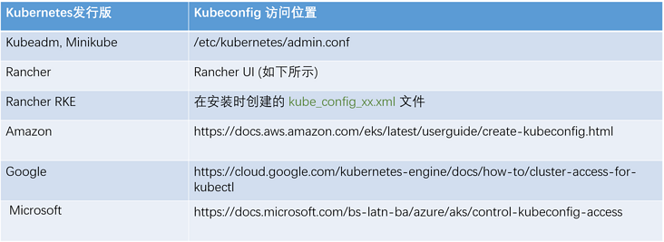

kubectl主要用于与Kubernetes API服务器通信，以在Kubernetes中创建、更新和删除工作负载

# 安装
kubectl是一个独立程序，安装方便
macos： `brew install kubernetes-cli`

# 使用
## 语法
```
kubectl [command] [TYPE] [NAME] [flags]
- command: 要执行的操作
- type：正在执行命令的资源类型
- name：对象的名称
- flags：标志
```
## kubeconfig
kubectl 通过配置文件来访问 Kubernetes 集群，默认的配置文件位于`~/.kube/config`，称为`kubeconfig`文件
kubeconfig 文件组织有关集群、用户、命名空间和身份验证机制的信息，kubectl命令使用这些文件来查找他在选择集群并与之通信时所需要的信息
加载顺序遵循以下规则：
1. 如果设置了`--kubeconfig`标志，则仅加载指定文件，该标志只能设置一次，不会发生合并
2. 如果设置了`$KUBECONFIG`环境变量，则根据系统的正常路径分隔规则，将其解析为文件系统路径列表
3. 否则，如果以上两项都未设置，则使用`~/.kube/config`文件，不进行任何合并

你可以通过多种方式创建配置文件，具体取决于你使用何种Kubernetes发行版。以下列出的是不同的K8S发行版及其位置：


对于Rancher统一管理的Kubernetes集群，您可以通过Web UI下载kubeconfig文件，并使用它通过kubectl连接到Kubernetes环境。


## 基本命令
### 管理kubectl配置
```
# 查看当前配置
kubectl config view
```
你将能看到的输出内容汇总展现了你所配置的集群和及上下文
要获得每个可用上下文的更简洁摘要，你可以键入：
```
kubectl config get-contexts
```
输出的内容显示了每个已定义上下文的详细信息以及当前选定的上下文，由星号（*）表示

要查看当前使用的上下文，使用命令：
```
kubectl config current-context
```
要更改要连接的上下文，请使用use-context命令:
```
kubectl config use-context node1
```

### 检查集群组件的状态
为集群选择好适当的上下文后，可以使用get componentstatuses（缩写为get cs）命令检查核心主组件的状态:
```
kubectl get cs
```
输出的内容将显示调度程序、控制器管理器和etcd节点的状态以及从每个服务收集的最新消息和错误。如果你的集群运行不正常，这是一个很好的、进行第一次诊断检查的机会。


可以使用cluster-info命令收集其他连接和服务信息：
```
kubectl cluster-info
```

查看集群成员信息：
```
kubectl get nodes -o wide
```

查看资源和事件信息：
命名空间
```
kubectl get namespaces
```

要查看与资源关联的事件，请使用get events命令：
```
kubectl get events
```


[参考1](https://segmentfault.com/a/1190000019740014)